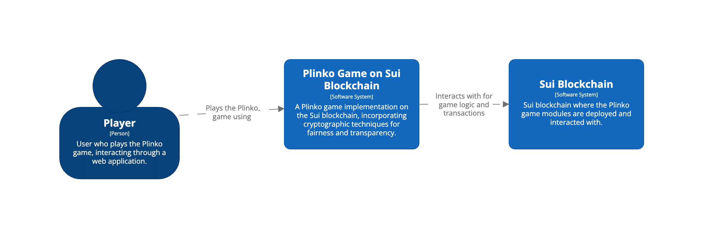
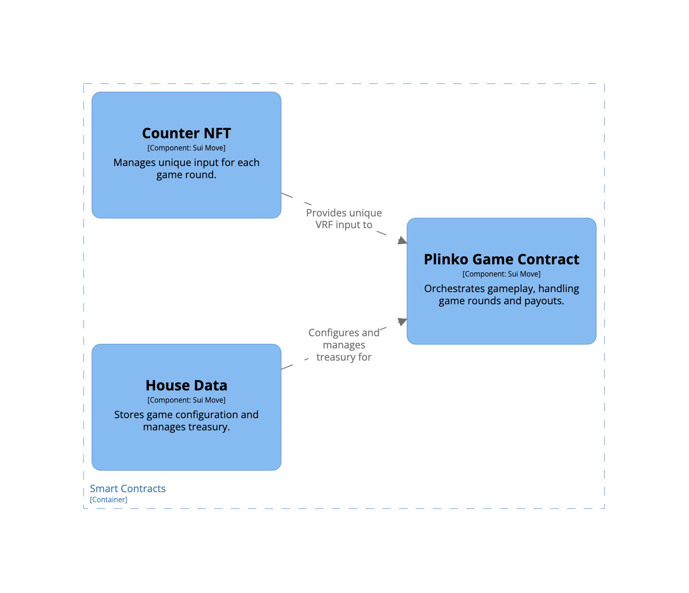
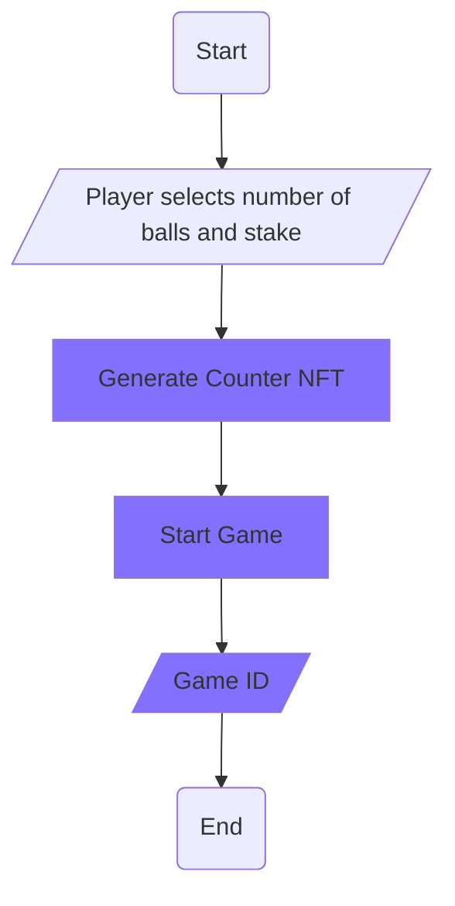
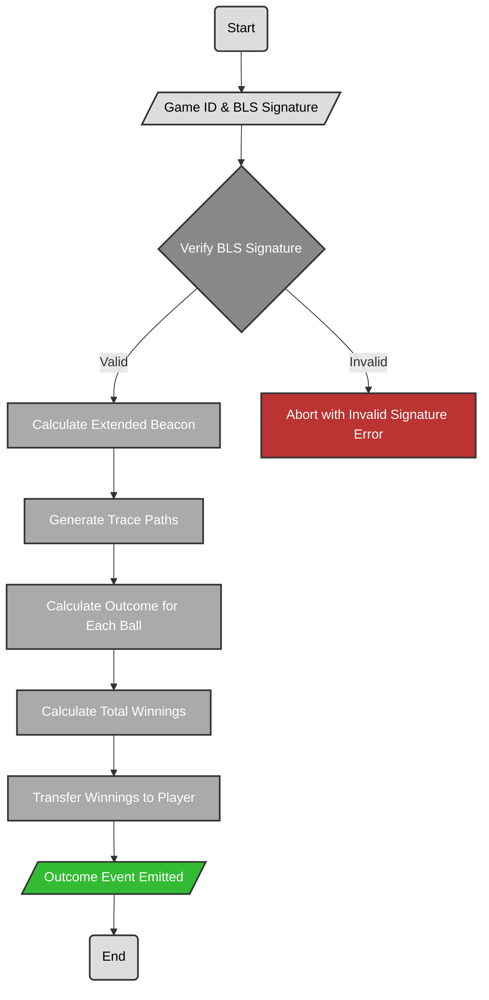

## Diagrams

### System Context Diagram

### Move Component Diagram

## Flowcharts and Sequence Diagrams

### Start a Plinko Game
This flowchart illustrates the process for a player to start a new game of Plinko, including staking SUI tokens and utilizing the Counter NFT for randomness.

### Finish a Plinko Game
This flowchart details the steps for completing a game round, including verifying the randomness with a BLS signature, calculating the outcome, and distributing the winnings.

- Verify BLS Signature
- Calculate Extended Beacon: This step involves extending the beacon using the number of balls to ensure there's enough random data to determine the path for each ball.
- Generate Trace Paths: Sequentially follows the beacon calculation. For each ball, the extended beacon's data is used to generate a trace path that simulates how the ball would fall through the pegged Plinko board.
- Calculate Outcome for Each Ball: Once the trace paths are generated, the outcome for each ball is calculated based on the path it takes and the multipliers it encounters.
- Calculate Total Winnings: After determining the outcome for each ball, the total winnings are calculated by summing up the results.
- Transfer Winnings to Player: This action involves transferring the calculated total winnings back to the player's account.
- Outcome Event Emitted: Finally, an event is emitted detailing the outcome of the game, which can be used for UI representation or audit purposes.

[Project Diagrams and FlowCharts](/Diagrams-FlowCharts.md)
