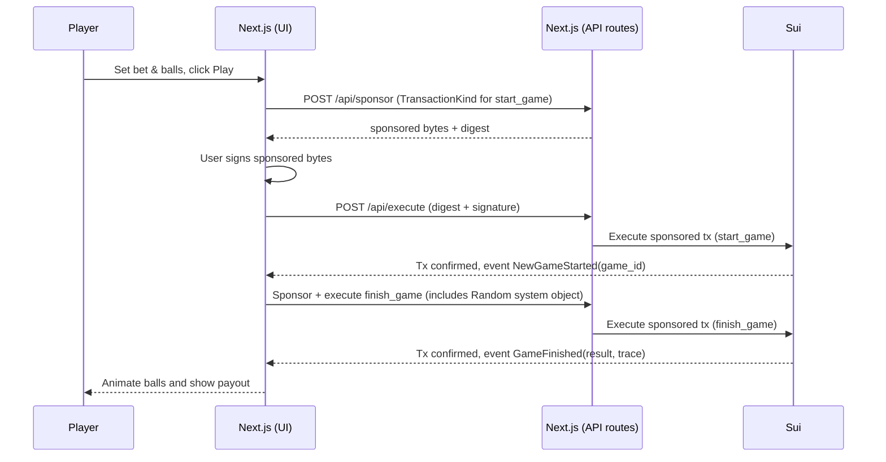

# Plinko on Sui

Provably-fair, gasless Plinko built on Sui. This version uses Sui's on-chain randomness and sponsored transactions via Enoki so players pay no gas.

## Gameplay

- Start: Player chooses number of balls and a per-ball bet. A SUI coin covering the total bet is passed to `plinko::start_game`.
- Finish: `plinko::finish_game` consumes the game and uses on-chain randomness to compute 12 random bytes per ball, tally even bytes, and map to a multiplier index. Payout = sum over balls of `(multiplier * stake_per_ball)/100`.
- Events: `NewGameStarted` on start, `GameFinished` with `result` and `trace` (raw random bytes) on finish.

## Betting rules (on-chain)

- Minimum stake: 0.1 SUI per game (total stake).
- Maximum stake: 10 SUI per game (total stake).
- Balls per game: 1–100.
- Multipliers (default): `[900, 820, 650, 380, 100, 60, 40, 60, 100, 380, 650, 820, 900]` (units are percent; e.g., 900 = 9.0x).
- Base fee: 100 bp (1%) configured in `house_data`.

These values are initialized in `plinko::house_data::initialize_house_data` and can be updated by the house where supported.

## Fairness

- Randomness: Move contract calls `random.new_generator(ctx)` and draws bytes via `generate_u8_in_range`, making outcomes unpredictable and unbiased on-chain.
- Transparency: Payouts and emitted events are on-chain; anyone can verify the results and traces.

## Architecture

- `plinko/`: Move contracts (`plinko.move`, `house_data.move`).
- `app/`: Next.js app (App Router) with UI and API routes under `src/app/api`.
  - Sponsorship endpoints: `POST /api/sponsor` and `POST /api/execute` wrap Enoki sponsorship APIs.
  - Server utilities for finishing games may initiate sponsored transactions.

## Sponsored transactions (Enoki)

1. UI constructs an unsigned transaction for `start_game` or `finish_game`.
2. UI requests sponsorship:
   - `POST /api/sponsor` → returns sponsored bytes and digest.
3. User signs the sponsored bytes with their wallet.
4. UI executes via `POST /api/execute`.
5. UI waits for confirmation, reads `NewGameStarted`/`GameFinished` events, and renders the result.

## Running locally

Prereqs:

- Node.js and `pnpm`.
- A Sui wallet address with enough SUI to cover your bets. No gas needed (sponsored).

App (UI + API routes):

1. `cd app`
2. `pnpm install`
3. Create `app/.env` with at least:
   - `NEXT_PUBLIC_SUI_NETWORK_NAME=testnet|devnet|mainnet`
   - `NEXT_PUBLIC_PACKAGE_ADDRESS=0x...` (deployed package)
   - `NEXT_PUBLIC_HOUSE_DATA_ID=0x...`
   - `NEXT_PUBLIC_MIN_BET_AMOUNT=100000000` (0.1 SUI in MIST)
   - `NEXT_PUBLIC_MAX_BET_AMOUNT=10000000000` (10 SUI in MIST)
   - `ENOKI_SECRET_KEY=...` (server-side, used by API routes)
4. `pnpm run dev` and open `http://localhost:3000`.

Contracts & setup:

- Deploy the Move package, then run `setup/src/setupHouseData.ts` to initialize `HouseData` with treasury balance and multipliers. It will write `HOUSE_DATA_ID`/`NEXT_PUBLIC_HOUSE_DATA_ID` into env files on success.

## Smart contracts

- `plinko::plinko`
  - `start_game(coin, &mut HouseData, &mut TxContext): ID`
  - `finish_game(game_id: ID, random: &Random, &mut HouseData, num_balls: u64, &mut TxContext)`
  - Emits `NewGameStarted` and `GameFinished(result, player, trace)`.
- `plinko::house_data` maintains treasury, min/max stake, fee, and multipliers. Defaults: min 0.1 SUI, max 10 SUI, fee 1%.

## Sequence

[Project Diagrams and FlowCharts](/Diagrams-FlowCharts.md)

This project is powered by Mysten Labs and the Sui blockchain technology.
